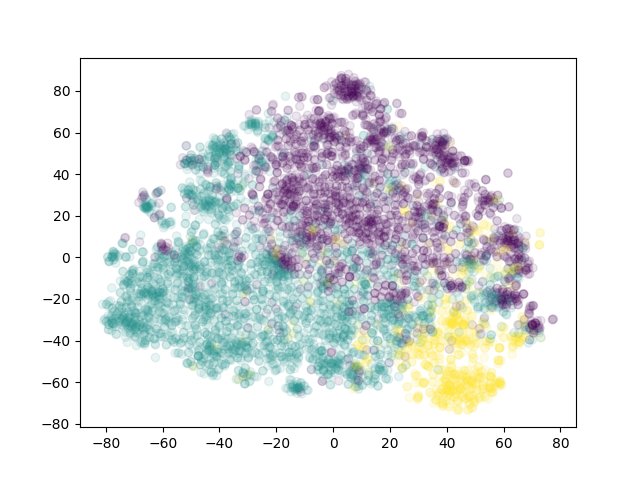

# homonyms
Find new word meanings in vector space by clustering their sentences.

Uses fasttext vectors, gensim, sklearn and [this wonderful project](https://github.com/Babylonpartners/fastText_multilingual).

Assumes you have downloaded necessary data, vectors and transformation files. They are available [here](https://drive.google.com/open?id=1Vg0792wD3SWn04R_GwmmsY92AkISY2EW).

`homonyms.config` provides a good deal of customization. I used pyyaml for that.

Data breakdown by number of samples, across 4 orders of magnitude.

```
  448308 total
  169117 bank.txt
  108071 club.txt
   96666 match.txt
   22020 bear.txt
   20683 volume.txt
   14100 mess.txt (non-homonym)
    9524 bat.txt
    5988 organ.txt
    1523 mint.txt
     616 stalk.txt
```

Not particularly informative, but here's a t-SNE visualization of one of the clusters, just because they're cool. 




*A plot of KMeans clustering for the word "organ"*

